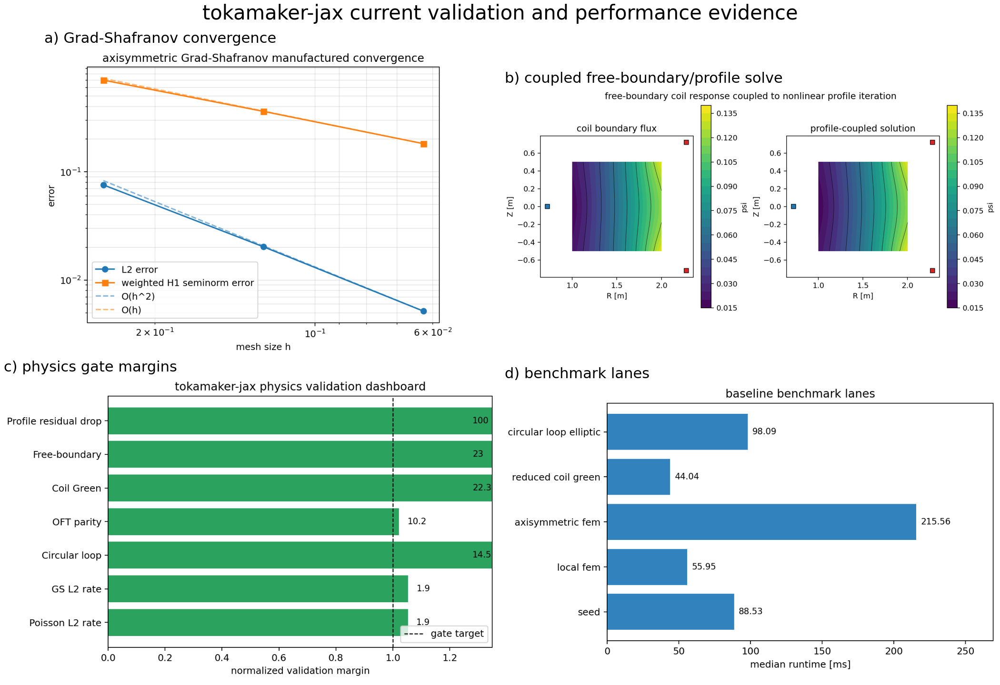
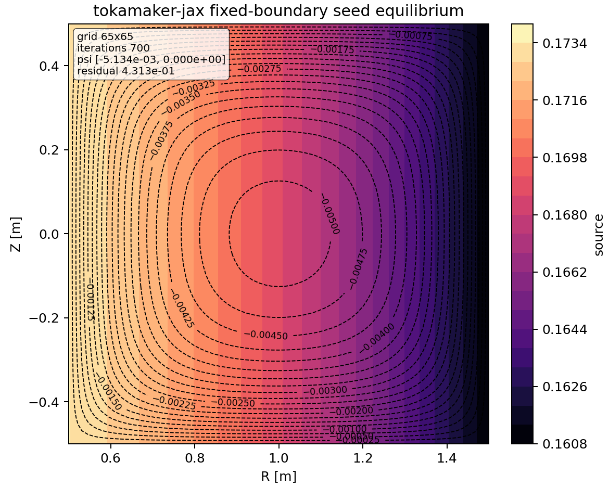
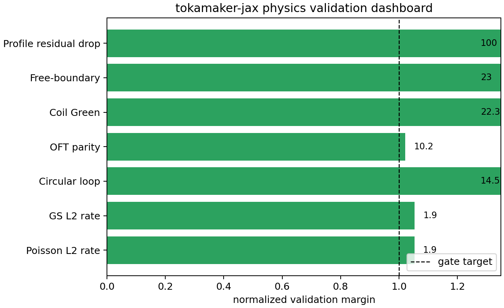
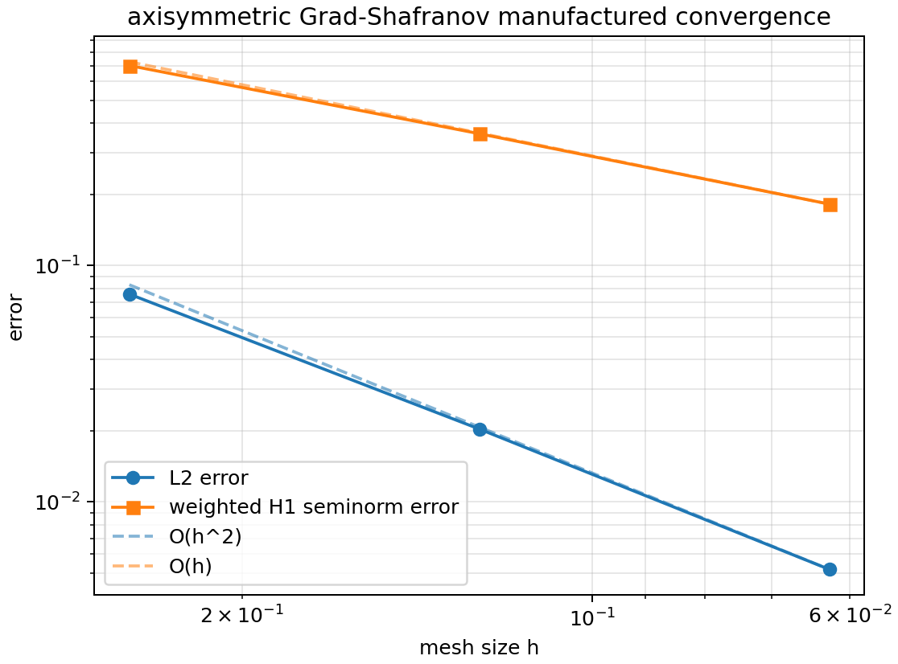
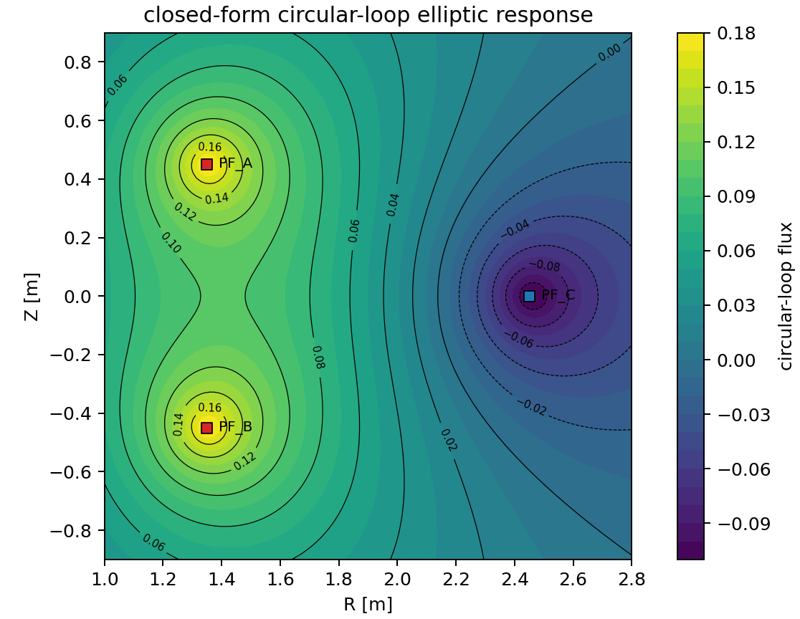
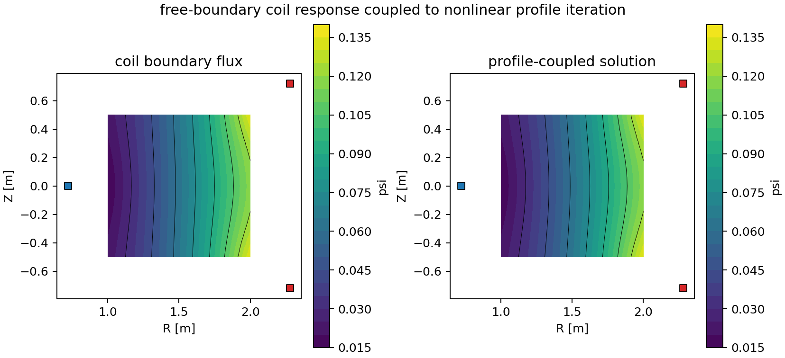
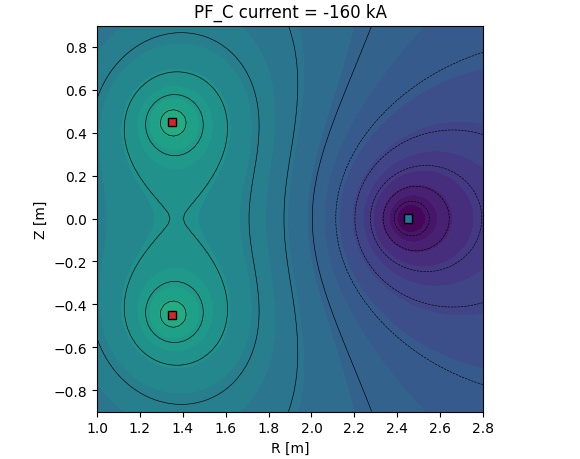
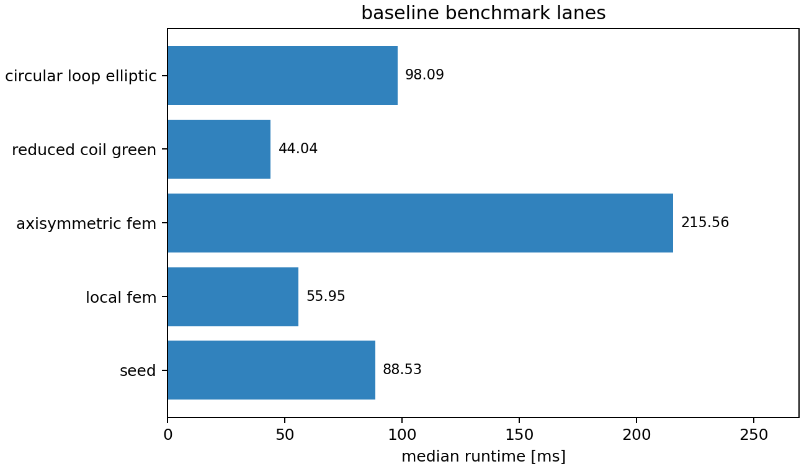
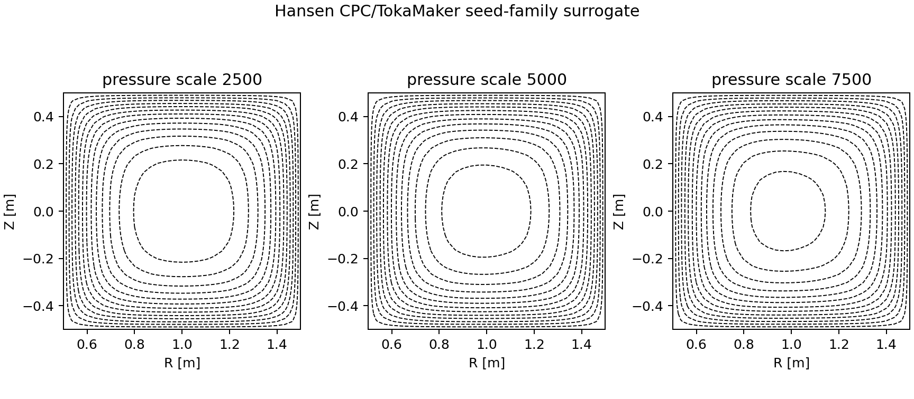
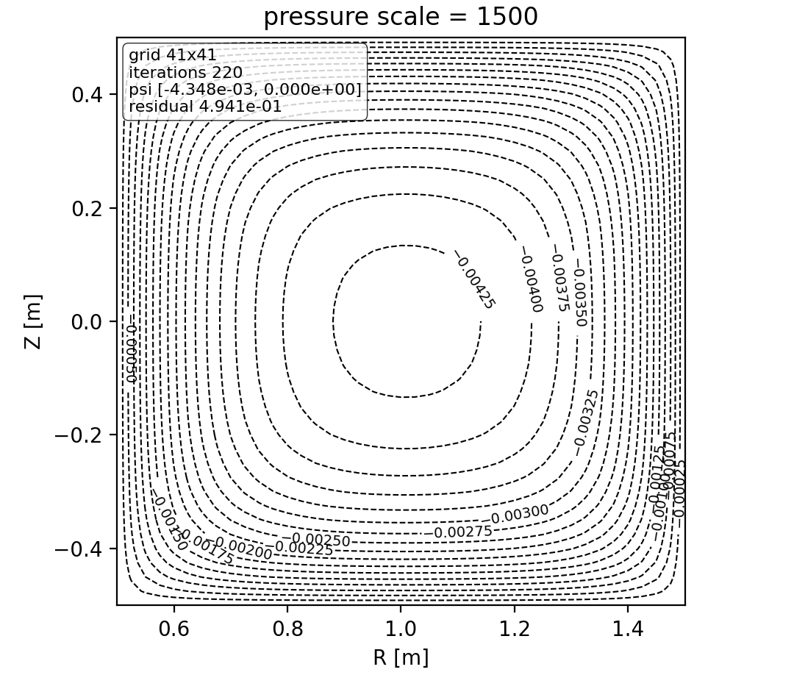

# tokamaker-jax

[](https://github.com/rogeriojorge/tokamaker_jax/actions/workflows/ci.yml)
[](https://tokamaker-jax.readthedocs.io/en/latest/)
[](https://codecov.io/gh/rogeriojorge/tokamaker_jax)
[](https://pypi.org/project/tokamaker-jax/)
[](LICENSE)

`tokamaker-jax` is a JAX-native porting project for TokaMaker, the OpenFUSIONToolkit Grad-Shafranov equilibrium tool. The target is an end-to-end differentiable, accelerator-ready solver with a friendlier Python API, TOML-driven CLI, GUI-first workflow, high-quality examples, plotting, docs, and at least 95% test coverage.

This repository currently contains the staged JAX port infrastructure, p=1 triangular FEM kernels, validation gates, GUI workflow, generated documentation assets, source audit, and porting plan/log. The complete feature parity port is tracked in [plan.md](plan.md).

## Quick Start

```bash
git clone https://github.com/rogeriojorge/tokamaker_jax.git
cd tokamaker_jax
pip install -e .
```

The default install includes GUI dependencies. Python 3.10 and newer are supported.

Launch the GUI:

```bash
tokamaker-jax
```

Run a TOML case and write a plot:

```bash
tokamaker-jax examples/fixed_boundary.toml --plot outputs/fixed_boundary.png
```

Run the main validation suite:

```bash
tokamaker-jax verify --gate all --subdivisions 4 8 16
```

Use from Python:

```python
from tokamaker_jax import load_config, solve_from_config

config = load_config("examples/fixed_boundary.toml")
solution = solve_from_config(config)
print(solution.stats())
```

For development and docs work:

```bash
pip install -e ".[dev,docs]"
```

TOML files use `tomllib` on Python 3.11+ and `tomli` on Python 3.10.

## Examples

Generate benchmark and literature-reproduction artifacts:

```bash
python examples/benchmark_report.py --output outputs/benchmark_report.json
python examples/reproduce_cpc_seed_family.py outputs/literature/cpc_seed_family
```

Run individual physics gates:

```bash
tokamaker-jax verify --gate grad-shafranov --subdivisions 4 8 16
tokamaker-jax verify --gate circular-loop
tokamaker-jax verify --gate oft-parity
tokamaker-jax verify --gate free-boundary-profile
```

## Visual Overview





















## Current Scope

- JAX differentiable fixed-boundary seed solver for the Grad-Shafranov operator on a rectangular grid.
- p=1 triangular FEM reference kernels, dense/sparse/matrix-free assembly, weighted axisymmetric Grad-Shafranov weak-form assembly, profile source loads, and manufactured convergence gates.
- Nonlinear p=1 profile iteration with pressure and FF' source terms, residual checks, and differentiability tests.
- Reduced large-aspect-ratio coil Green's-function fixture plus a closed-form circular-loop elliptic Green's-function kernel checked against high-resolution quadrature.
- Free-boundary/profile coupling gate that drives the nonlinear FEM iteration from circular-loop coil boundary flux and checks coil-current/profile-scale differentiability.
- OpenFUSIONToolkit/TokaMaker comparison probe that records local upstream availability and runs numeric `eval_green` parity when the original compiled library is available.
- TOML configuration loader with Python 3.10 compatibility.
- CLI that launches the GUI by default and runs TOML files when supplied.
- Matplotlib plotting utilities, generated validation figures, CPC seed-family reproduction surrogate, and JSON figure recipes.
- NiceGUI workflow dashboard summaries and stored-report tables for solver, validation, plotting, benchmark, and reproduction lanes.
- Expanded documentation with equations, derivations, design decisions, input/output artifact contracts, upstream/literature comparison levels, and publication-ready generated figures.
- Sphinx and Read the Docs setup.
- GitHub Actions for linting, testing with coverage, benchmark artifact upload, docs, and release publishing.

## Porting Target

The full port will cover TokaMaker's unstructured finite-element mesh workflow, fixed/free-boundary equilibria, coil and passive conductor modeling, profile functions, reconstruction constraints, wall modes, time-dependent stepping, EQDSK/i-file IO, and publication-quality plotting. See [plan.md](plan.md) for the full breakdown, validation matrix, and implementation log.

## Attribution

This project is derived from planning and source review of [OpenFUSIONToolkit/OpenFUSIONToolkit](https://github.com/OpenFUSIONToolkit/OpenFUSIONToolkit), especially its TokaMaker component. Cite Hansen et al., *Computer Physics Communications* 298, 109111 (2024), DOI: [10.1016/j.cpc.2024.109111](https://doi.org/10.1016/j.cpc.2024.109111), when using TokaMaker-derived work.
