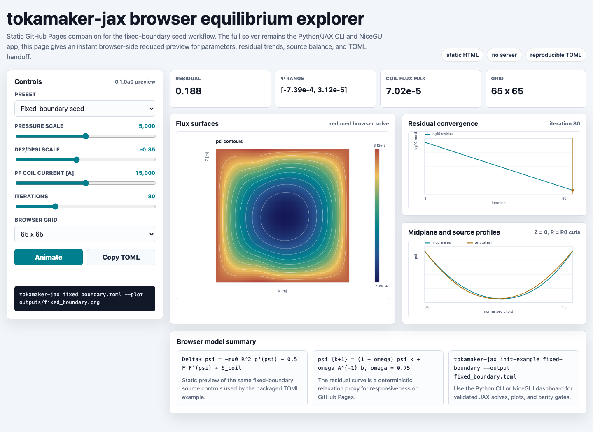

# Browser Explorer

The static browser explorer is a GitHub Pages companion for the fixed-boundary
seed workflow:



```{raw} html
<p><a class="reference external" href="_static/tokamaker_jax_explorer.html">Open the browser equilibrium explorer</a></p>
<iframe src="_static/tokamaker_jax_explorer.html" title="tokamaker-jax browser equilibrium explorer" style="width: 100%; min-height: 860px; border: 1px solid #d7dde8; border-radius: 8px;"></iframe>
```

It runs entirely in the browser, so it is suitable for GitHub Pages. It is a
reduced preview of the packaged fixed-boundary example, not a replacement for
the Python/JAX solver or the NiceGUI research dashboard.

Use the CLI for validated runs:

```bash
tokamaker-jax init-example fixed-boundary --output fixed_boundary.toml
tokamaker-jax fixed_boundary.toml --plot outputs/fixed_boundary.png
tokamaker-jax verify --gate all --subdivisions 4 8 16
```
