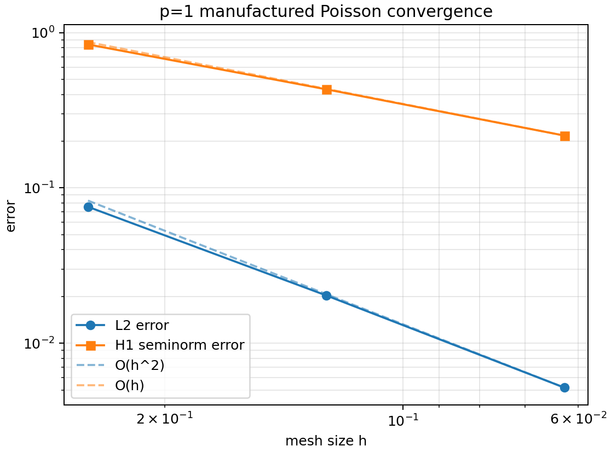
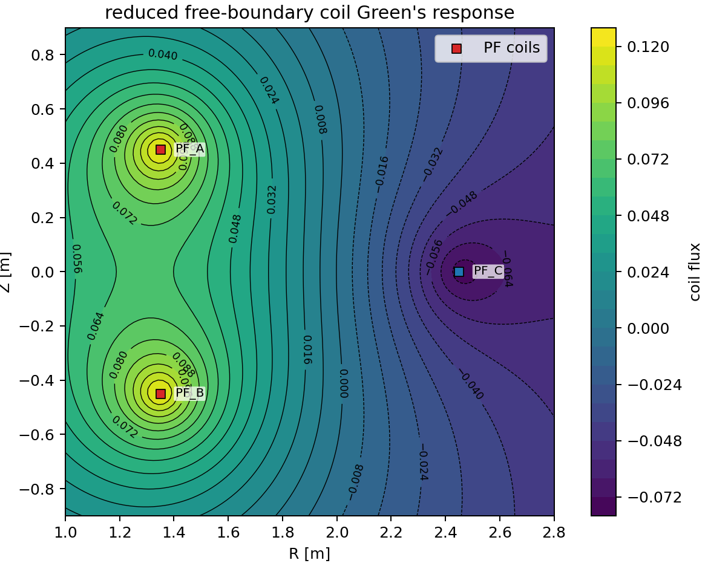

# Validation

This page defines the current validation gates for `tokamaker-jax`. The goal is
to make every physics, differentiability, figure, and performance claim
traceable to an executable command, a fixture, a tolerance, and an artifact.

The first machine-readable manifest is
[`docs/validation/physics_gates_manifest.json`](validation/physics_gates_manifest.json).
It separates implemented gates from planned gates so the project can document
the roadmap without claiming full TokaMaker parity before the relevant tests
exist.

## Implemented Gates

The current implemented gates cover the seed infrastructure and the first local
triangular FEM path:

- p=1 triangular basis, gradients, quadrature, affine maps, local mass matrices,
  and local Laplace stiffness matrices.
- dense global p=1 triangular mass and Laplace stiffness assembly for fixed
  mesh topology.
- p=1 load-vector assembly, dense Dirichlet reduction, matrix-free operator
  application, sparse `BCOO` assembly, and a manufactured Poisson convergence
  gate on uniformly refined unit-square meshes.
- coefficient-weighted p=1 mass/stiffness assembly, sparse and matrix-free
  weighted stiffness paths, axisymmetric Grad-Shafranov weak-form assembly,
  profile-source load vectors, and a cylindrical manufactured-solution gate.
- a reduced free-boundary coil Green's-function fixture with analytic symmetry,
  linearity, derivative, and radial log-ratio checks.
- TOML parsing and `tokamaker-jax validate` checks for grid, solver, coil,
  output, and region-geometry inputs.
- fixed-boundary seed solver tests, including JAX differentiation checks on the
  current rectangular-grid path.
- figure metadata exports and GUI-ready summary data.
- small executable benchmark helpers for seed-solver and local-FEM timings.

## P1 Triangle Equations

On the reference triangle
$(\hat x_1,\hat x_2,\hat x_3)=((0,0),(1,0),(0,1))$, the p=1 basis is

$$
\hat \phi_1 = 1-\xi-\eta,\qquad
\hat \phi_2 = \xi,\qquad
\hat \phi_3 = \eta,
$$

with gradients

$$
\nabla_{\xi,\eta}\hat\phi_1=(-1,-1),\qquad
\nabla_{\xi,\eta}\hat\phi_2=(1,0),\qquad
\nabla_{\xi,\eta}\hat\phi_3=(0,1).
$$

For physical vertices $x_1,x_2,x_3$, the affine map is

$$
x(\xi,\eta)=x_1+\begin{bmatrix}x_2-x_1 & x_3-x_1\end{bmatrix}
\begin{bmatrix}\xi\\ \eta\end{bmatrix}.
$$

The local mass matrix used as an exact validation oracle is

$$
M^K = \frac{|K|}{12}
\begin{bmatrix}
2 & 1 & 1\\
1 & 2 & 1\\
1 & 1 & 2
\end{bmatrix}.
$$

The local Laplace stiffness matrix is

$$
A^K_{ij} = |K|\,\nabla\phi_i\cdot\nabla\phi_j.
$$

Implemented tests check interpolation at nodes, partition of unity, exact
degree-2 reference-triangle quadrature, affine mapping consistency, matrix
symmetry, positive mass eigenvalues, stiffness positive semidefiniteness, and
the constant-vector stiffness nullspace.

## Global Assembly Gates

For a fixed-connectivity triangular mesh, local element contributions are
scattered into a global nodal matrix:

$$
A_{IJ} = \sum_{K}\sum_{i,j=1}^{3}
\mathbf{1}_{T_{K,i}=I}\mathbf{1}_{T_{K,j}=J} A^K_{ij}.
$$

The first assembly gate uses a two-triangle unit square with exact global mass
and stiffness matrices. It verifies symmetry, mass total, stiffness row sums,
constant nullspace, eigenvalue signs, JIT compatibility, and gradients with
respect to node coordinates for fixed topology.

## Manufactured-Solution Gate

The first implemented manufactured-solution gate is a Poisson problem:

$$
-\Delta u=f,\qquad u|_{\partial\Omega}=g.
$$

For shape-regular p=1 triangular refinement, the expected rates are

$$
\|u-u_h\|_{H^1(\Omega)}=O(h),\qquad
\|u-u_h\|_{L^2(\Omega)}=O(h^2).
$$

The observed convergence rate will be computed as

$$
p_\mathrm{obs} =
\frac{\log(e(h_m)/e(h_{m+1}))}{\log(h_m/h_{m+1})}.
$$

The implemented gate uses

$$
u(x,y)=\sin(\pi x)\sin(\pi y),
\qquad
f(x,y)=2\pi^2\sin(\pi x)\sin(\pi y),
$$

on the unit square with exact Dirichlet boundary values. It assembles the p=1
load vector by degree-3 triangle quadrature, applies nodal Dirichlet values by
dense reduction, solves the interior system, and reports observed rates.



## Axisymmetric Grad-Shafranov Gate

The implemented axisymmetric FEM gate uses the self-adjoint form of the
Grad-Shafranov operator. With

$$
\Delta^*\psi = R\frac{\partial}{\partial R}
\left(\frac{1}{R}\frac{\partial \psi}{\partial R}\right)
\frac{\partial^2\psi}{\partial Z^2},
$$

the manufactured validation problem is written as

$$
-\nabla\cdot\left(\frac{1}{R}\nabla\psi\right)=q
\qquad\hbox{on}\qquad \Omega=[1,2]\times[-0.5,0.5].
$$

The p=1 element stiffness entries are

$$
A^K_{ij} =
\int_K \frac{1}{R}\nabla\phi_i\cdot\nabla\phi_j\,dR\,dZ.
$$

The source profile helper follows the TokaMaker/OpenFUSIONToolkit convention
used by the seed solver,

$$
\Delta^*\psi = -\frac{1}{2}\frac{dF^2}{d\psi}
-\mu_0 R^2\frac{dp}{d\psi},
$$

so the weak source density for the negated self-adjoint equation is

$$
q_\mathrm{profile}(R,Z)=
\frac{1}{2R}\frac{dF^2}{d\psi}+\mu_0 R\frac{dp}{d\psi}.
$$

The manufactured exact solution is

$$
\psi(R,Z) =
\sin\left(\pi(R-1)\right)\sin\left(\pi(Z+0.5)\right),
$$

with exact boundary values on all four sides. The corresponding weak source is

$$
q(R,Z)=
\frac{(k_R^2+k_Z^2)\psi}{R}
+\frac{\partial\psi/\partial R}{R^2},
\qquad
k_R=k_Z=\pi.
$$

The gate integrates the true L2 value error and the true weighted H1 seminorm
error by element quadrature, rather than only comparing nodal vectors:

$$
\|e\|_{L^2(\Omega)}^2=\int_\Omega e^2\,dR\,dZ,
\qquad
|e|_{H^1_R(\Omega)}^2=
\int_\Omega \frac{1}{R}\|\nabla e\|^2\,dR\,dZ.
$$

The executable command is:

```bash
tokamaker-jax verify --gate grad-shafranov --subdivisions 4 8 16
```


## Reduced Free-Boundary Coil Gate

The first free-boundary fixture is deliberately smaller than the full
TokaMaker circular-filament Green's function. It uses the large-aspect-ratio
two-dimensional free-space Green's function with a small regularization radius
for each coil:

$$
G(R,Z;R_c,Z_c,\epsilon)=
-\frac{\mu_0}{4\pi}
\log\left(
\frac{(R-R_c)^2+(Z-Z_c)^2+\epsilon^2}{a_\mathrm{ref}^2}
\right).
$$

For coil currents $I_c$, the reduced boundary flux is

$$
\psi_c(R,Z)=\sum_c G(R,Z;R_c,Z_c,\epsilon_c) I_c.
$$

The analytic gradient used by the differentiability gate is

$$
\nabla G =
-\frac{\mu_0}{2\pi}
\frac{(R-R_c,\;Z-Z_c)}
{(R-R_c)^2+(Z-Z_c)^2+\epsilon^2}.
$$

The fixture verifies exact superposition, symmetry about a centered coil,
automatic differentiation against the analytic gradient, and the radial
Green's-function difference

$$
G(\rho_2)-G(\rho_1)=
-\frac{\mu_0}{4\pi}
\log\left(\frac{\rho_2^2+\epsilon^2}{\rho_1^2+\epsilon^2}\right).
$$

The executable command is:

```bash
tokamaker-jax verify --gate coil-green
```



## Differentiability Gates

Differentiability gates compare JAX automatic differentiation with central
finite differences for scalar objectives:

$$
D_vF(x)_\mathrm{fd} =
\frac{F(x+\epsilon v)-F(x-\epsilon v)}{2\epsilon},
\qquad
D_vF(x)_\mathrm{ad}=\nabla F(x)\cdot v.
$$

The reported discrepancy is

$$
\eta_\nabla =
\frac{|D_vF(x)_\mathrm{ad}-D_vF(x)_\mathrm{fd}|}
{\max(1, |D_vF(x)_\mathrm{fd}|)}.
$$

Every differentiability gate must record dtype, backend, seed, perturbation
scale, topology assumptions, and whether gradients pass through dense matrices,
matrix-free operators, iterative solves, or implicit VJPs.

## Performance Gates

Performance gates are regression checks, not hardware-independent speed claims.
Each benchmark record must include command, fixture, dtype, backend, warmup
policy, repeat count, and hardware metadata when run in CI or release reports.

For timing baselines, the regression ratio is

$$
\rho_t = \frac{t_\mathrm{new}}{t_\mathrm{baseline}}.
$$

The current benchmark helpers produce JSON-friendly timing dictionaries for the
seed fixed-boundary solve, local p=1 FEM kernels, axisymmetric global FEM
assembly/matrix-free apply, and reduced coil Green's-function response. Future
gates should add CI baselines and full free-boundary solve timings.

## Literature-Anchored Figure Gates

Figure reproduction gates are anchored to the sources listed on the
[](references.md) page, especially the OpenFUSIONToolkit source/docs and the
TokaMaker CPC paper/preprint. A figure gate must include:

- source label and figure identifier,
- executable reproduction command,
- input fixture or case TOML,
- generated image/movie/table artifact,
- numerical comparison rule or documented visual-comparison criterion,
- tolerances and failure mode.

Until a literature figure has a checked-in script and artifact, its status
remains `planned`.
